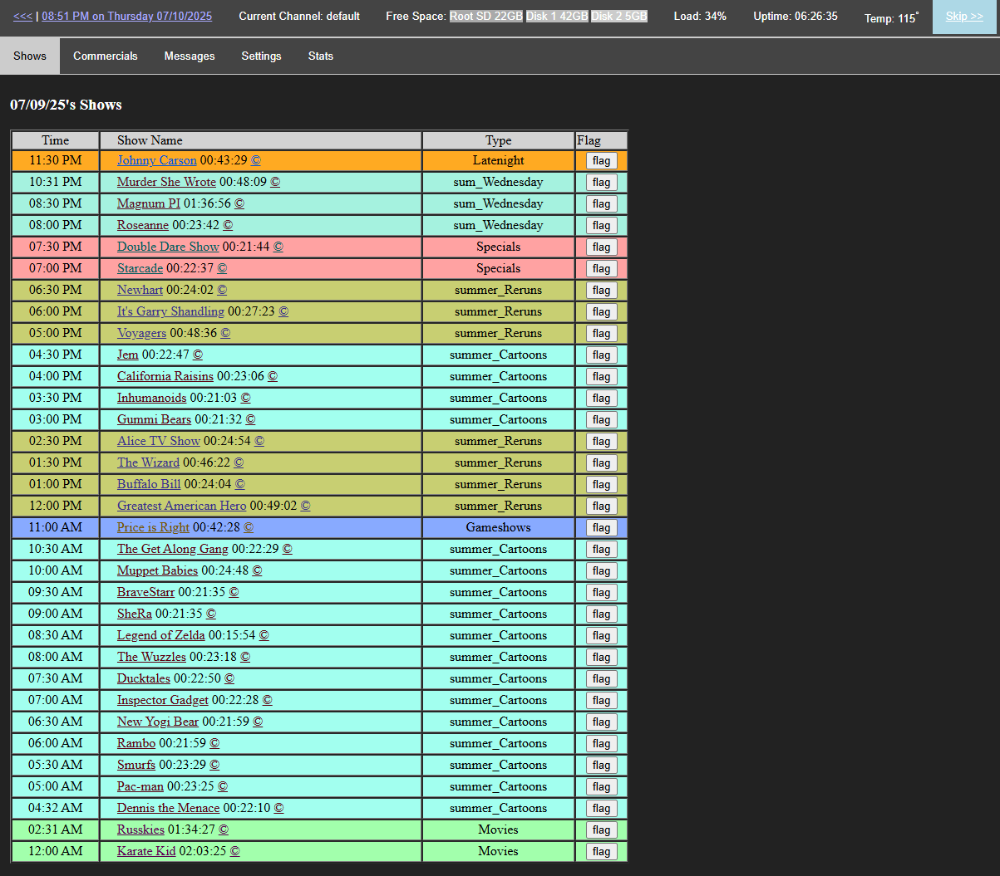
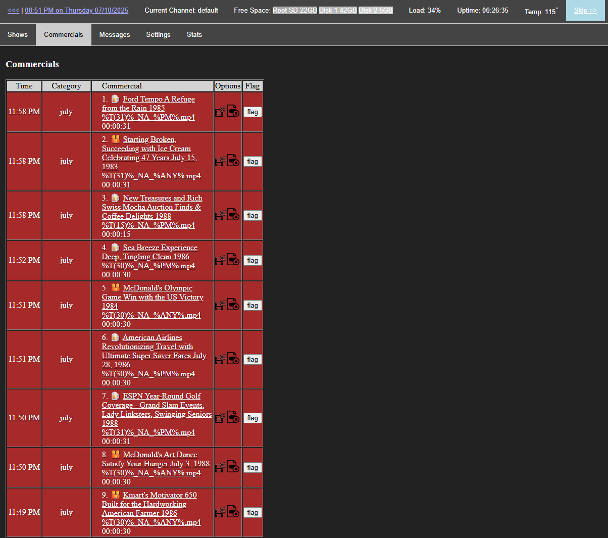
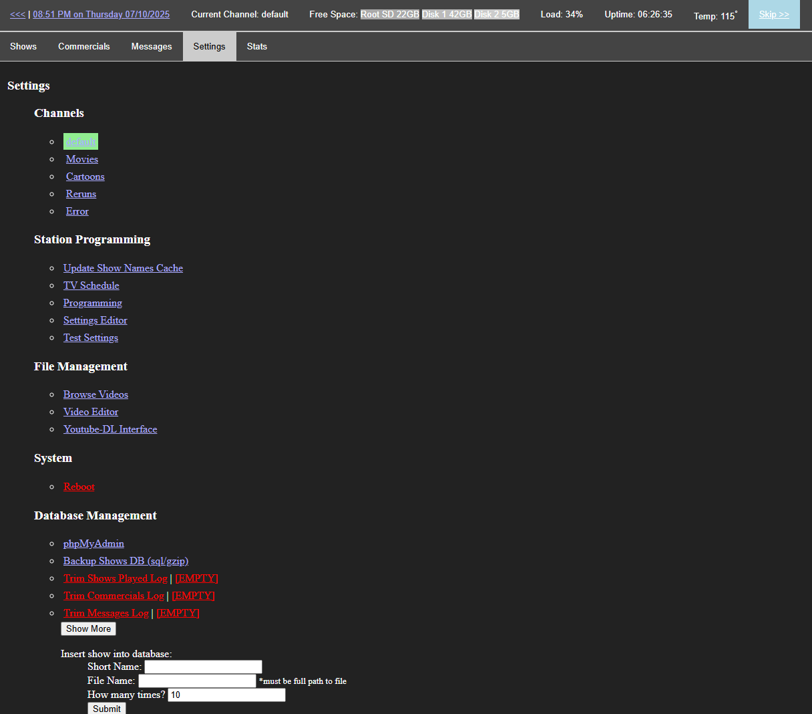
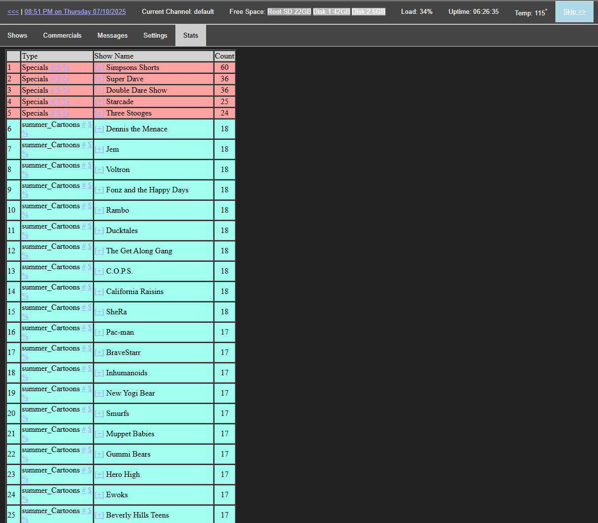

# Retro TV Station: Automated Broadcast Emulator

This project consists of a suite of Python 2 and PHP scripts designed to emulate and automate a fully functional broadcast TV station. It is optimized for the Raspberry Pi 3B+, utilizing the 3.5mm A/V output to provide an authentic analog signal for CRT televisions.

This system reproduces the experience of vintage television by injecting period-accurate commercials and bumpers into programming at precise, pre-defined intervals.

## Core Functionality
The engine runs on the Raspberry Pi, utilizing OMXPlayer and D-Bus to manage video hardware acceleration and seamless transitions between primary content and commercial breaks.

* **Hardware Playback:** Leverages [python-omxplayer-wrapper](https://github.com/willprice/python-omxplayer-wrapper) for high-performance video delivery on legacy Pi hardware.
* **Scheduled Injection:** Automates the insertion of advertisements and station IDs to mimic a professional broadcast schedule.
* **Analog Optimization:** Specifically tuned for 4:3 aspect ratios and composite output to maintain a genuine retro aesthetic.

## Component Ecosystem
To maintain a high-quality broadcast, media must be properly mastered. Two companion Windows utilities are provided to handle file preparation:

1. **[VideoSplit](https://github.com/mopenstein/VideoSplit):** An FFMPEG-based automation tool that identifies commercial breaks by detecting black frames and normalizes audio levels across all clips for consistent broadcast volume (amoungst other useful things for this project).
2. **[Simple Video Editor](https://github.com/mopenstein/Simple-Video-Editor):** A streamlined FFMPEG frontend designed for precise manual video splitting and combining.

## Technical Requirements & Compatibility
* **Hardware:** Raspberry Pi 3B+ (utilized for stable A/V composite output).
* **Operating System:** Raspberry Pi OS (Legacy/Buster) is required to support the deprecated OMXPlayer binary and OpenMAX hardware abstraction layer.
* **Environment:** Python 2.7

# Fully automated functioning TV Station

This project reproduces a near perfect functioning tv station.

  
  
  
  

## Getting Started: The Easy Way vs. The Manual Way

Because this software relies on `omxplayer` (which was deprecated in recent Raspberry Pi OS updates), setting up the environment manually can be difficult.

### Option 1: The Pre-Configured System Image (Fastest) - https://github.com/mopenstein/raspberry_pi_tv_station/tree/main/disk%20image%20install%20files
I have provided a verified system image of a working SD card. 
* Everything is pre-installed (omxplayer, dependencies, Python environment); guaranteed to work on a Pi 3b+.
* This image is a clean install from my workign system withthe necessary project dependencies added. However, if you are uncomfortable using a pre-made image, please use Option 2.

### Option 2: Manual Installation (much harder)
If you prefer to build the system yourself:
1. Flash **Raspberry Pi OS (Legacy) Buster** using the Raspberry Pi Imager.
2. Enable the Legacy GL Driver (FKMS) in `raspi-config`.
3. Install dependencies manually:
   `sudo apt update && sudo apt install omxplayer libdbus-1-3 libdbus-1-dev`
